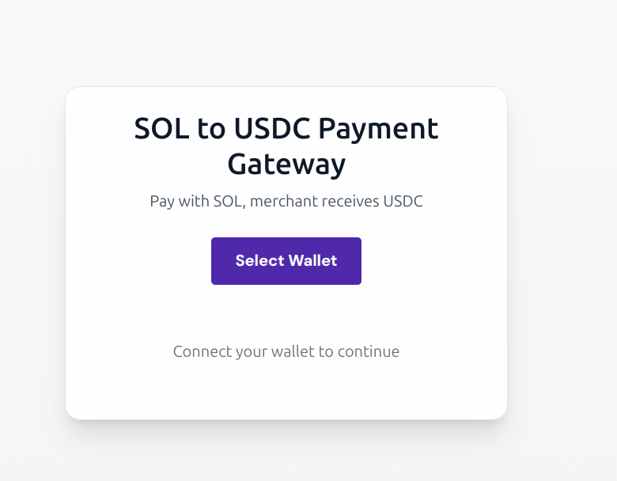
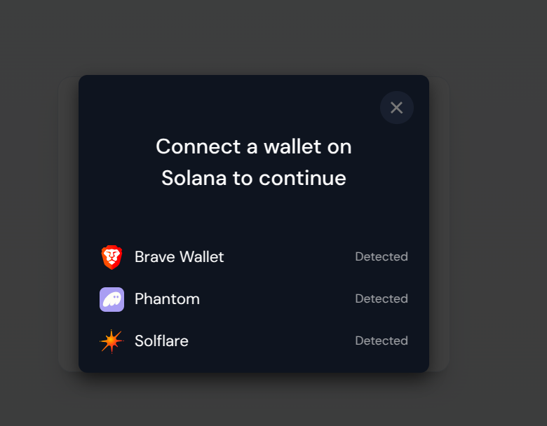
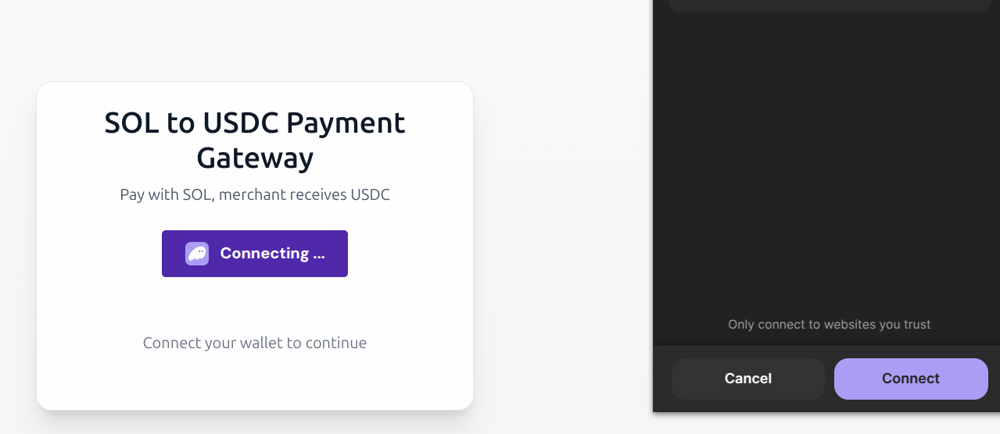
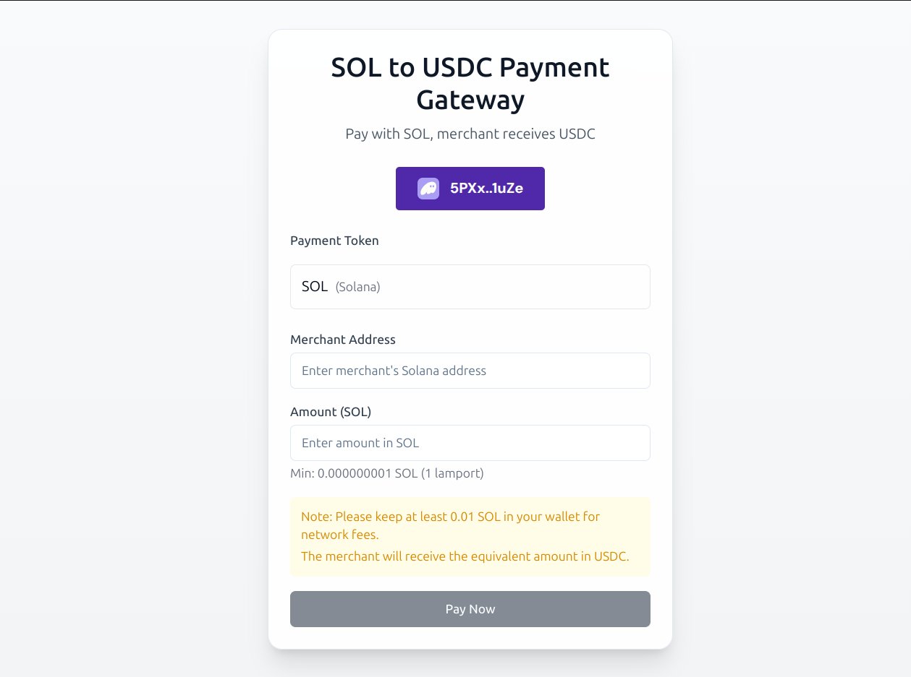
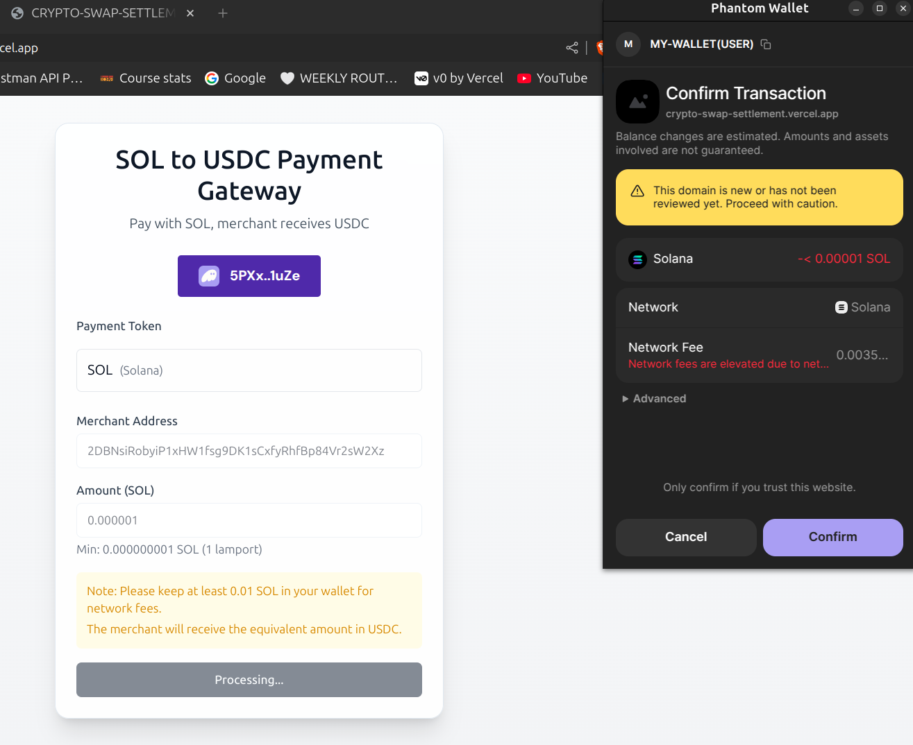
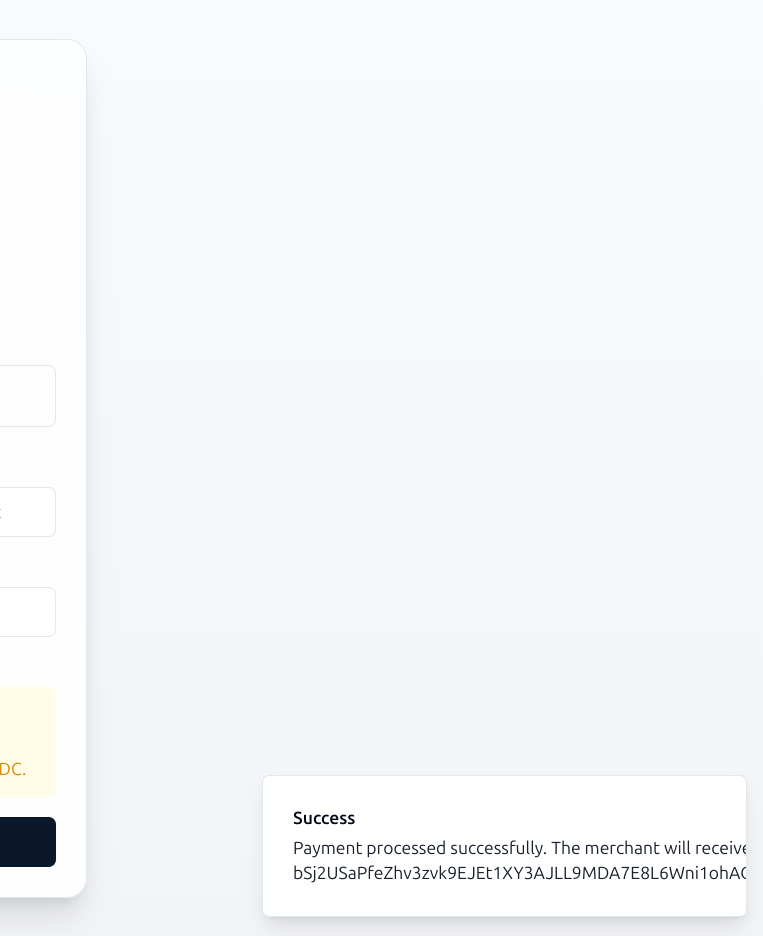

# Crypto gateway payment settlement system

## Overview

This is a payment gateway application that allows users to make payments in SOL (Solana) and receive USDC (USD Coin) as a merchant built by leveraging the Jupiter swap API. The application is built using React, TypeScript, and Vite, leveraging various libraries for UI components and state management.

## Key Features

- **Wallet Integration**: Users can connect their Solana wallets to make payments.

- **Payment Processing**: Users can enter the merchant's address and the amount in SOL to process payments.

- **Real-time Quotes**: The application fetches real-time quotes for SOL to USDC swaps.

- **Responsive Design**: The application is designed to be mobile-friendly.

- **Error Handling**: Comprehensive error handling for wallet connection, payment processing, and API requests.



## Technologies Used

- **React**: A JavaScript library for building user interfaces.
- **TypeScript**: A superset of JavaScript that adds static types.
- **Vite**: A build tool that provides a fast development environment.
- **Tailwind CSS**: A utility-first CSS framework for styling.
- **Solana Web3.js**: A JavaScript library for interacting with the Solana blockchain.
- **Jupiter API**: For fetching quotes and executing swaps between SOL and USDC.
- **Radix UI**: A set of unstyled, accessible components for building UI.

## File Structure

```
src/
├── components/
│   ├── payment/
│   │   ├── PaymentForm.tsx
│   │   └── TokenSelector.tsx
│   ├── ui/
│   │   ├── button.tsx
│   │   ├── card.tsx
│   │   ├── input.tsx
│   │   ├── select.tsx
│   │   ├── toast.tsx
│   │   └── tooltip.tsx
│   └── ...
├── hooks/
│   ├── use-mobile.tsx
│   └── use-toast.ts
├── lib/
│   ├── jupiter.ts
│   └── utils.ts
├── pages/
│   ├── Index.tsx
│   └── NotFound.tsx
├── App.tsx
├── main.tsx
└── index.css
```

### Important Files

- **PaymentForm.tsx**: Contains the main logic for processing payments.
- **TokenSelector.tsx**: A component for selecting the payment token.
- **jupiter.ts**: Contains functions for interacting with the Jupiter API to get quotes and execute swaps.
- **use-toast.ts**: Custom hook for managing toast notifications.
- **Index.tsx**: The main landing page of the application.

## Running the Application Locally

To run the application locally, follow these steps:

### Prerequisites

- **Node.js**: Ensure you have Node.js installed on your machine. You can download it from [nodejs.org](https://nodejs.org/).
- **Yarn or npm**: You can use either package manager to install dependencies.

### Steps

1. **Clone the Repository**:
   ```bash
   git clone https://github.com/Ge0frey/CRYPTO-SWAP-SETTLEMENT.git
   cd CRYPTO-SWAP-SETTLEMENT
   ```

2. **Install Dependencies**:
   Using npm:
   ```bash
   npm install
   ```
   Or using Yarn:
   ```bash
   yarn install
   ```

3. **Set Up Environment Variables**:
   Create a `.env` file in the root directory and add the following:
   ```env
   VITE_RPC_ENDPOINT="https://mainnet.helius-rpc.com/?api-key=YOUR_API_KEY"
   VITE_HELIUS_API_KEY=YOUR_API_KEY
   ```
   Replace `YOUR_API_KEY` with your actual Helius API key.

4. **Run the Development Server**:
   ```bash
   npm run dev
   ```
   Or using Yarn:
   ```bash
   yarn dev
   ```

5. **Open the Application**:
   Open your browser and navigate to `http://localhost:5173` to view the application.

## Usage

1. **Connect Wallet**: Click on the "Connect Wallet" button to connect your Solana wallet.
2. **Enter Merchant Address**: Input the merchant's Solana address.
3. **Enter Amount**: Specify the amount in SOL you wish to send.
4. **Submit Payment**: Click on "Pay Now" to process the payment.

## Conclusion

This is a powerful and user-friendly payment gateway for processing SOL payments. With its responsive design and real-time quote fetching, it provides a seamless experience for both users and merchants. Feel free to explore the codebase and contribute to the project!
